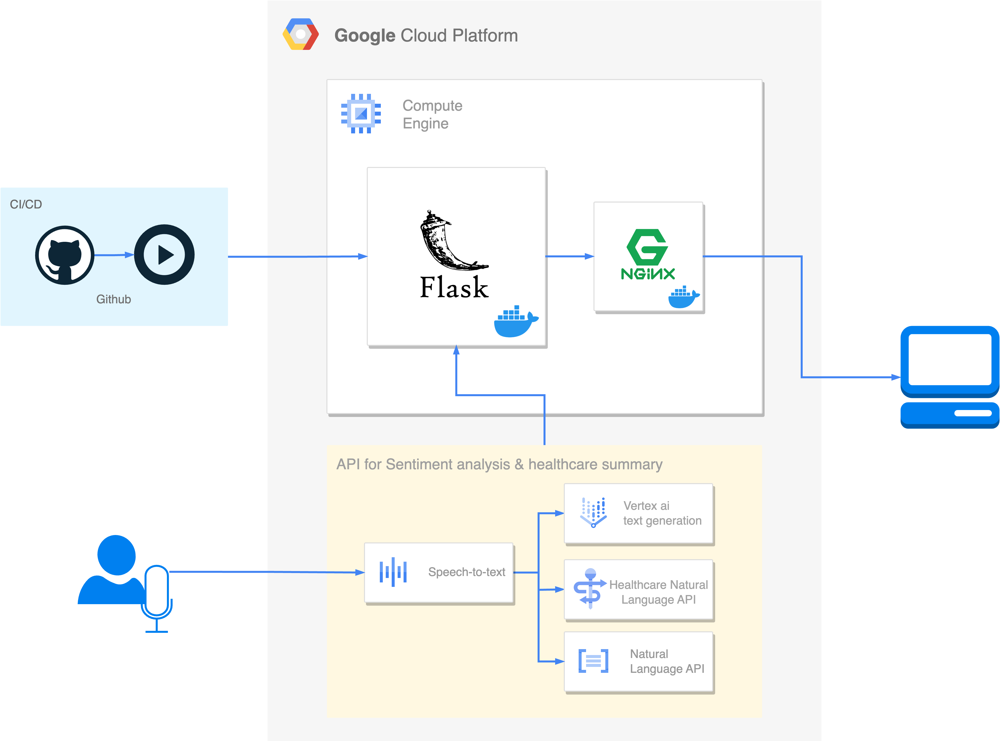

# GCP-TEAM2 😃
[노션](https://far-fossa-e64.notion.site/94272df5c9344a48bc73169efd122623?pvs=4)

```
GCP-TEAM2/
│
├── static/                 
│   ├── css/                                    # CSS 파일들
│   ├── js/                                     # JavaScript 파일들
│   └── images/                                 # 이미지 파일들
│
├── templates/               
│   ├── index.html                              # index 페이지
│   ├── main_page.html                          # 메인 화면
│   ├── show_text_emotion_analysis.html         # 감정분석 결과 페이지
│   └── show_text_summary.html                  # 환자 녹음 내용 요약, 키워드 정확도
│
├── services/                                   # 비즈니스 로직
│   ├── settings.py                             # 프로젝트명, 키설정
│   ├── sound_to_text.py                        # STT 구현, json 반환
│   ├── summary.py                              # summary, keyword 분석, json 반환
│   ├── text_emotion_analysis.py                # 감정분석, json 반환
│   └── voice
│       ├── [음성 파일 이름]_stt.json  
│       ├── [음성 파일 이름]_health_response.json
│       └── [음성 파일 이름].flac  
│
├── app.py                   # Flask 앱의 메인 실행 파일
├── config.py                # 애플리케이션 설정 / 이것도 없어도 됨
├── .env                     # 환경 변수 파일
├── Dockerfile               # 컨테이너 환경
├── docker-compose.yml       # nginx + flask 서버
└── requirements.txt         # 프로젝트 의존성 목록 파일
```

