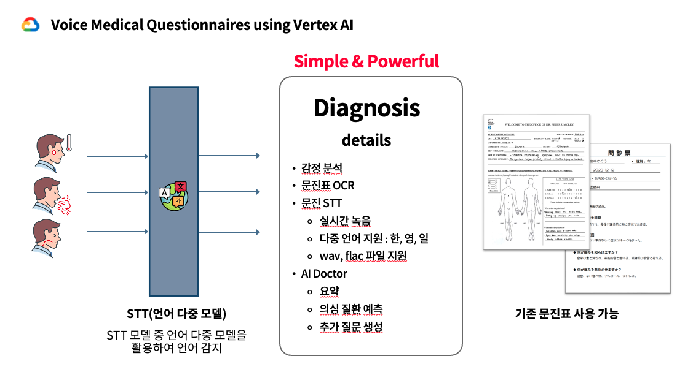
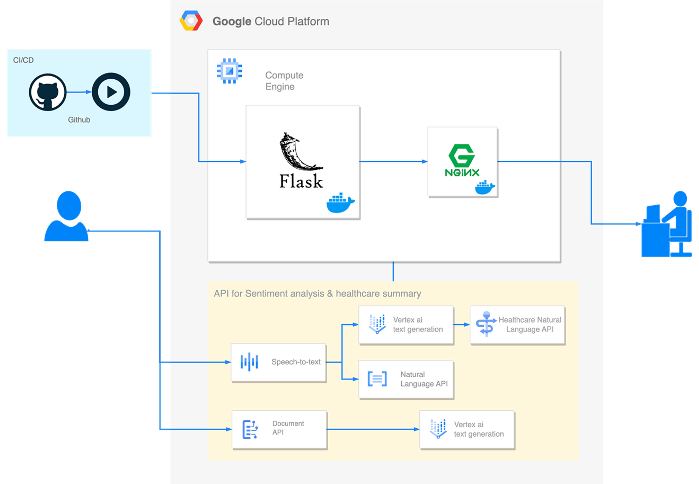

# VoiceDoctor 🧑🏼‍⚕️

### Members
강승구, 김민지, 김지창, 유혜린

### 프로젝트 진행 기간
2023.11.17 ~ 2023.11.27

### 개요
환자가 녹음한 문진 내용을 입력해 감정분석, 요약, 키워드 분석 결과를 보여주는 CDSS.  
(CDSS : 환자로부터 얻어진 임상 정보를 바탕으로 의료인이 질병을 진단하고 치료할 때 의사결정을 도와주는 시스템)  
Google Cloud Platform을 적극 활용하여 개발했습니다.
지원언어: 음성인식 - 한국어, 영어, 일본어 / pdf 업로드 - 영어, 일본어


### GCP API
- Speech to Text API
- Natural Language API
- Healthcare Natural Language API
- Vertex Ai Text Generation Model
- Document Ai API

### 아키텍쳐


### 프로젝트 구조
```
GCP-TEAM2/
│
├── static/                 
│   ├── css/                                    # CSS 파일들
│   ├── js/                                     # JavaScript 파일들
│   └── images/                                 # 이미지 파일들
│
├── templates/               
│   ├── index.html                              # index 페이지
│   ├── main_page.html                          # 메인 화면
│   ├── show_text_emotion_analysis.html         # 감정분석 결과 페이지
│   └── show_text_summary.html                  # 환자 녹음 내용 요약, 키워드 정확도
│
├── services/                                   # 비즈니스 로직
│   ├── settings.py                             # 프로젝트명, 키설정
│   ├── sound_to_text.py                        # STT 구현, json 반환
│   ├── summary.py                              # 텍스트 요약, 키워드 분석, json 반환
│   ├── text_emotion_analysis.py                # 감정분석, json 반환
│   └── voice
│       ├── [음성 파일 이름]_stt.json  
│       ├── [음성 파일 이름]_health_response.json
│       └── [음성 파일 이름].flac  
│
├── app.py                                      # Flask 앱의 메인 실행 파일
├── config.py                                   # 애플리케이션 설정 / 이것도 없어도 됨
├── .env                                        # 환경 변수 파일
├── Dockerfile                                  # 컨테이너 환경
├── docker-compose.yml                          # nginx + flask 서버
└── requirements.txt                            # 프로젝트 의존성 목록 파일
```

### 참고
[노션](https://far-fossa-e64.notion.site/94272df5c9344a48bc73169efd122623?pvs=4)

### 시연 영상
[](https://youtu.be/4RMyuYGm1PM)
